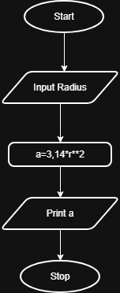

## Problem Statement
Write a Python program that calculates the area of a circle when the radius is provided by the user.
Use π = 3.14 and display the area.

---

## Algorithm
1. Start  
2. Read the radius `r` from the user  
3. Calculate the area using the formula:  
   Area = 3.14 × r × r  
4. Display the area  
5. Stop  

---

## Flowchart

---

## Execution

  

