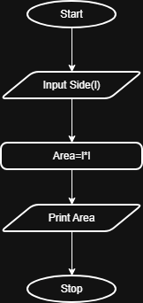

## Problem Statement
Write a Python program that prompts the user to enter the Side Length of a square and computes the area of the square.

---

## Algorithm
1. Start  
2. Read the side length s of the square
3. Calculate the area using the formula:
4. Area=𝑠×𝑠
5. Display the area
6. Stop
---

## Flowchart

---

## Execution

  

