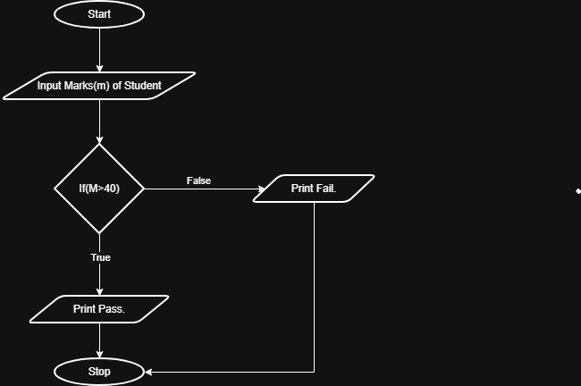

## Problem Statement
Write a Python program to determine whether a student passed the exam or not based on their marks.

---

## Algorithm
1. Start.  
2. Read the marks obtained by the student.
3. If marks > 40
   → Display “Pass”.
4. Else
   → Display “Fail”.
5. Stop.
---

## Flowchart

---

## Execution

  

